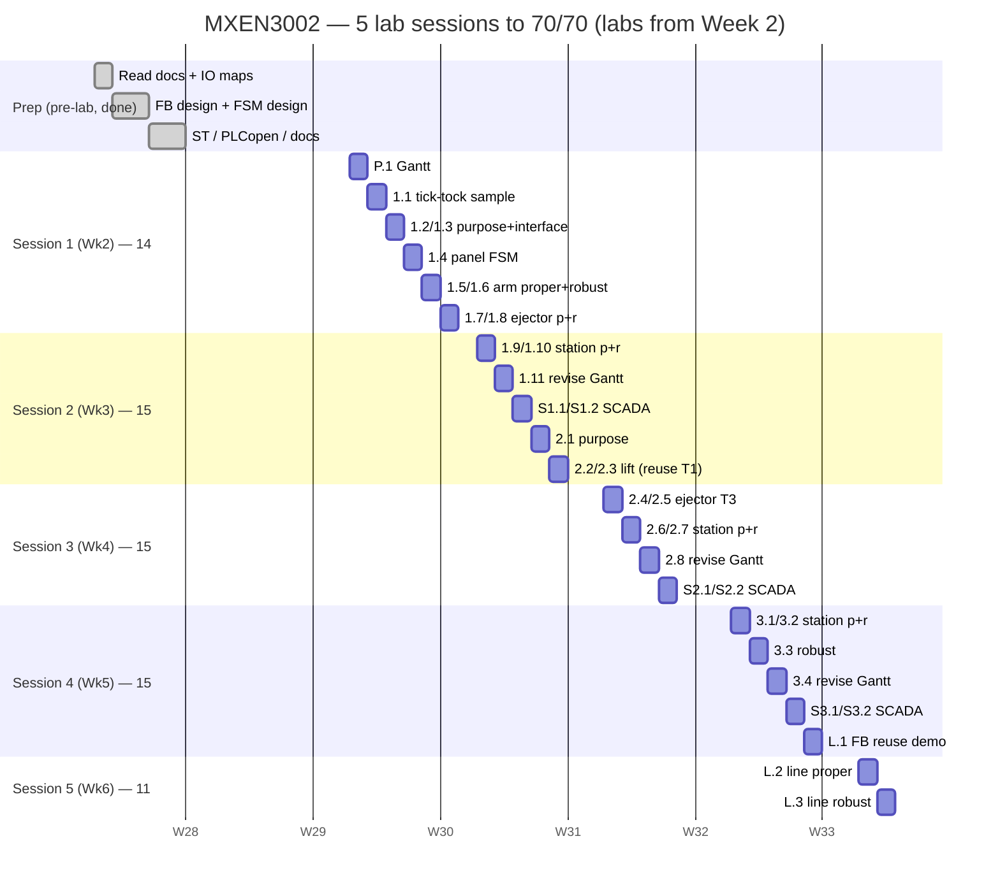

# P.1: Project Gantt Chart and Strategy for Maximum Marks (1 mark)

*The half-page writeup P.1 asks for. The mark-claim argument below is the "how I
would achieve maximum marks" discussion; revise it at 1.11 / 2.8 / 3.4.*

> **Excel version:** `gantt.xlsx` (colour-coded bar chart + marks summary, prints
> landscape) is the logbook-ready form. Regenerate it with `python
> gen_gantt_xlsx.py` after editing the schedule. The mermaid chart below is the
> same schedule for on-screen viewing.

## Strategy in one paragraph

The lab is worth 70 marks claimed **in-lab**, capped at **15 marks per 3-hour
session**, with milestones gated by prerequisites. Two facts decide the plan.
First, the **function blocks are shared across stations** (L.1): `FB_Panel` on all
three, `FB_Actuator_T1` on Distributing + Testing, `FB_Actuator_T2` on
Distributing + Sorting, `FB_Actuator_T3` on Testing + Sorting. So the winning move
is to **design the FBs generic and correct once, on Station 1, and reuse them
unchanged**. Stations 2 and 3 then become mostly wiring and Main-block logic rather
than new control code. Second, everything that *can* be prepared before the lab **has
been**: type-in-ready ST + PLCopen import, printable FSM/block diagrams, and an
printable FSM/block diagrams. Lab time is spent only on what needs hardware: typing/importing, tuning the
stall timers, building the Ignition screens, and demoing. That collapses the work
into **five sessions to 70/70**, each filled to the 15-mark cap in prerequisite
order.

## Mark-claim schedule (this is the maximum-marks plan)

| Session | Claim | Marks | Running |
|---|---|---:|---:|
| 1 | P.1, 1.1–1.8 | 14 | 14 |
| 2 | 1.9, 1.10, 1.11, S1.1, S1.2, 2.1, 2.2, 2.3 | 15 | 29 |
| 3 | 2.4–2.8, S2.1, S2.2 | 15 | 44 |
| 4 | 3.1–3.4, S3.1, S3.2, L.1 | 15 | 59 |
| 5 | L.2, L.3 | 11 | 70 |

Every session is at or just under the 15-mark cap, and every claim's prerequisites
are satisfied by an earlier claim (verified in `../08_lab_checklists/session_plan.md`).
Because the FBs are pre-built and pre-verified, Session 1 reaches 1.8 (the full
arm + ejector, proper and robust) in one sitting, and the later stations ride on
that reuse.

## Gantt

*(Milestone numbering follows the difficulty and prerequisites in the marking
scheme; 3.3 is the Sorting robust milestone claimed within Session 4.)*

## Revision notes (fill in at the bench: 1.11 / 2.8 / 3.4)

Milestones **1.11, 2.8, 3.4** are each 1 mark for **revisiting this Gantt and
discussing why you have / haven't met your objectives**. Keep short notes as you
go:

- **1.11 (after Station 1):** Did Sessions 1–2 land 1.1–1.10 as planned? Note any
  time lost to `t_stall` tuning or the 7-step cycle on real hardware, and adjust
  Session 3's start accordingly. Confirm `FB_Panel` and `FB_Actuator_T1/T2` were
  built generic enough to reuse (they are; see `../07_integrated/line_design.md`).
- **2.8 (after Station 2):** Did reusing `FB_Actuator_T1` on the lift save the time
  it was supposed to? Note whether the beam-polarity check or the single-sensor T3
  ejector needed rework, and whether S2 SCADA fit in Session 3.
- **3.4 (after Station 3):** Did the two-branch `FB_Actuator_T2` reuse and the
  stopper `FB_Actuator_T3` drop in without changes? Confirm you're on track for L.1–L.3 in
  Sessions 4–5, and record the final variance from this plan.

A written variance ("planned X, actual Y, because Z, so I did W") is what these 3
marks reward.
