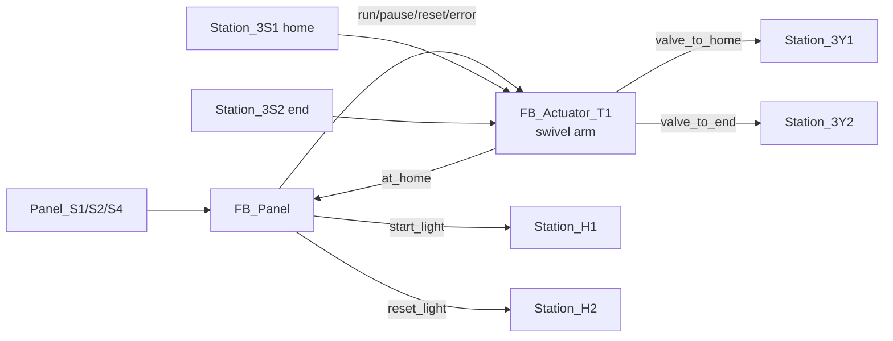
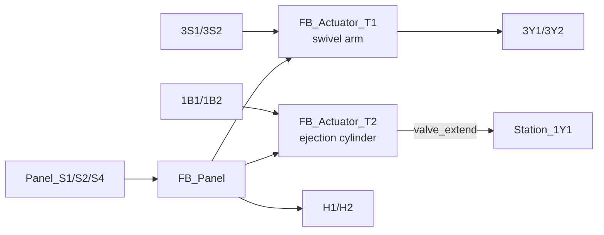
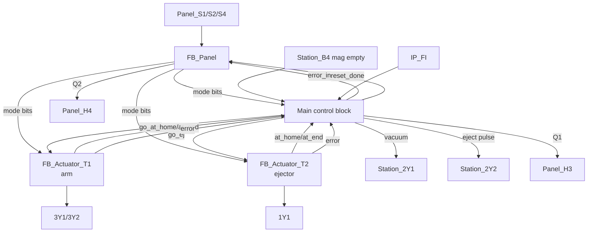

# Distributing Station — Block Diagrams (1.5 → 1.7 → 1.9)

Block diagrams grow one block at a time across the milestones. Each shows how the
control-panel mode bits fan out to the actuator FBs, and how sensor inputs and
valve outputs wire to each block. All arrows are BOOL signals.

## 2-block version — Milestone 1.5 (arm only)

`FB_Panel` outputs the mode; `FB_Actuator_T1` reads the mode + its two limit
switches and drives its two solenoids. The arm's `at_home` feeds back as the
panel's `reset_done`.

## 3-block version — Milestone 1.7 (add ejection cylinder)

## 4-block version — Milestone 1.9 (full station)

**The four blocks are:** `FB_Panel`, `FB_Actuator_T1`, `FB_Actuator_T2`, and
**Main**. Design rules the milestone enforces, all satisfied here:

- **`Station_2Y1` (vacuum) and `Station_2Y2` (ejector pulse) live in Main**, never
  in `FB_Actuator_T1`.
- **The unused sensors/valves** (`Station_B4` magazine-empty, `IP_FI`) are wired
  into **Main**, the "main control block".
- Main runs the **7-step cycle sequencer** and the **5-piece batch counter**, and
  aggregates the actuator faults into the panel's `error_in`.

For milestone 1.10 (robust) the block diagram is unchanged — the same four blocks,
with the actuator FBs' `robust` input set TRUE and Main forwarding their `error`
plus the piece-missing / magazine-empty checks to `FB_Panel`.
