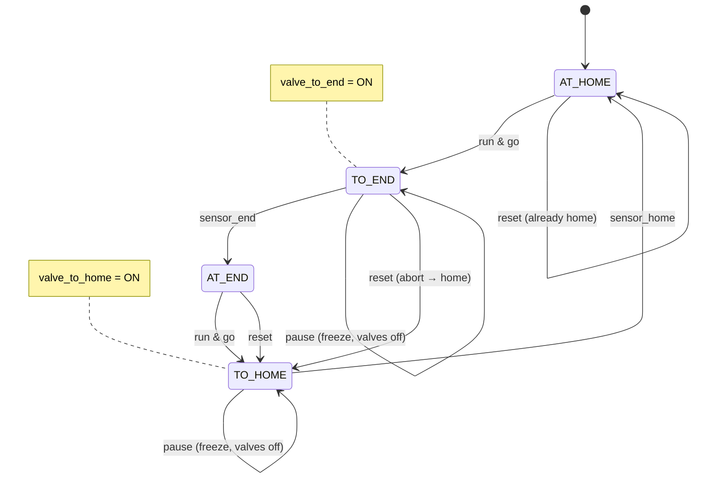
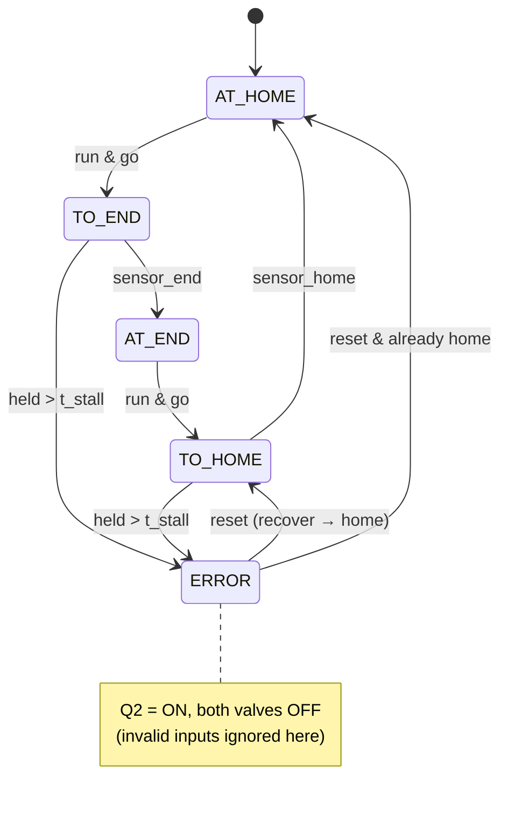

# FB_Actuator_T1 — Finite-State Diagram (Milestones 1.5 proper, 1.6 robust)

Holdable double-solenoid actuator = the **swivel arm** here (and the **Testing
lift**, reused).
Key property: **pause stops it immediately mid-stroke**; resume continues to the
same target; reset drives it home.

## Proper (Milestone 1.5)

Mapping to the 1.5 protocol:

- **Reset while in-between → home:** any state + `reset` routes to `TO_HOME →
  AT_HOME`.
- **Run → continuous end-and-back:** `AT_HOME→TO_END→AT_END→TO_HOME→AT_HOME` with
  `go` held (Main holds it in 1.9; the standalone arm free-cycles).
- **Pause mid-swivel → stops; resume → continues forward:** the `pause` self-loop
  freezes `TO_END` (valves off, position held); when run returns it resumes
  `TO_END` — never jerking home.
- **Reset from paused → directly home:** `reset` from the frozen `TO_END` goes to
  `TO_HOME`.

## Robust (Milestone 1.6) — adds stall detection

Mapping to the 1.6 protocol:

- **Home→End stall / End→Home stall:** holding the arm so a valve is commanded but
  the target sensor never arrives runs the `t_stall` TON out → `ERROR`, Q2 on,
  motion stopped. Both directions have the edge.
- **Invalid transition in Error:** pressing Start in `ERROR` has no edge → ignored.
- **Valid recovery:** `ERROR --reset--> TO_HOME → AT_HOME`, panel returns to Pause
  (via `reset_done`), then Start runs again — the two-press recovery.

`t_stall` is an FB **input** (default `T#2s`) — tune it at the bench.
