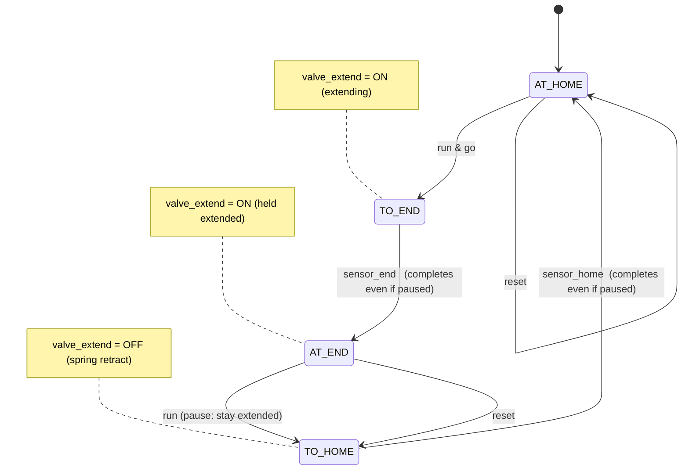
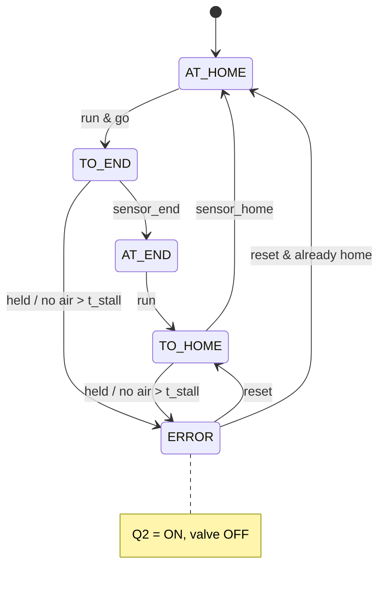

# FB_Actuator_T2 — Finite-State Diagram (Milestones 1.7 proper, 1.8 robust)

Stroke-completing single-acting cylinder = the **ejection cylinder** here (and the
**Sorting branches**, reused). Key property (opposite of T1): **pause takes effect only at the end of a
stroke** — a stroke in progress always finishes to a limit switch.

## Proper (Milestone 1.7)

Mapping to the 1.7 protocol:

- **Reset in pause → retract fully home:** `reset` routes to `TO_HOME → AT_HOME`.
- **Run → extend fully then retract continuously:** the four-state ring with `go`.
- **Mid-travel Stop must NOT stop mid-stroke:** the `TO_END --sensor_end--> AT_END`
  and `TO_HOME --sensor_home--> AT_HOME` edges fire **regardless of pause**, so the
  stroke completes to a limit; only the `AT_END --run--> TO_HOME` advance is gated
  by run, so the cylinder halts at a limit in Pause.
- **Resume → next stroke:** Start at `AT_END` → `TO_HOME`.

The single solenoid is held ON at `AT_END` so a spring-return cylinder can *halt
extended* in Pause; it releases (retracts) only when run advances it to `TO_HOME`.

## Robust (Milestone 1.8) — adds stall detection

Mapping to the 1.8 protocol: holding the cylinder (or cutting compressed air) so a
motion state cannot reach its sensor within `t_stall` → `ERROR`, Q2 on, valve off;
both directions covered; Start in Error ignored; recover with Reset then Start.
