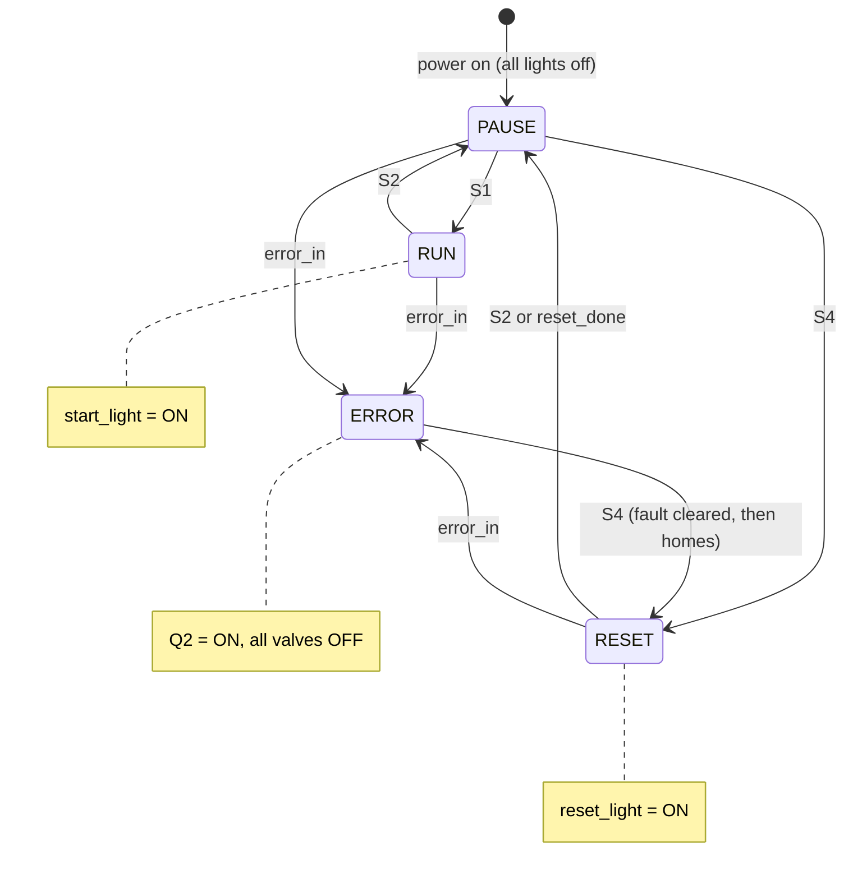

# FB_Panel — Finite-State Diagram (Milestone 1.4)

The control-panel FSM, shared by all three stations. Buttons: S1 = Start, S2 = Stop, S4 = Reset.
`error_in` = latched fault from the actuators/Main; `reset_done` = all actuators
home. This one diagram is the "correct finite-state diagram for your ladder
diagram" that 1.4 asks for.

## Why the invalid transitions are simply absent

The 1.4 protocol tests that **nothing happens** when you press:

- **S1 in Reset** — there is no `RESET --S1-->` edge, so it is ignored.
- **S4 in Run** — there is no `RUN --S4-->` edge, so it is ignored.
- **S1 or S2 in Error** — the only way out of Error is S4.

Because Start and Reset lights are bound one-to-one to the `RUN` and `RESET`
states, and those states are mutually exclusive, **only one light is ever on**.

## The `reset_done` edge (why it matters for the actuator milestones)

`RESET --reset_done--> PAUSE` lets the panel drop back to Pause automatically once
the actuators finish homing. That is what makes the "reset then start" recovery in
milestones 1.6/1.8 a **two-press** action. In the panel-only milestone 1.4 there
are no actuators, so `reset_done` is tied FALSE and **Reset is exited only by S2**
— exactly the behaviour tested in step 5 (Stop in Reset → Pause) and step 6 (Start
in Reset → ignored).
