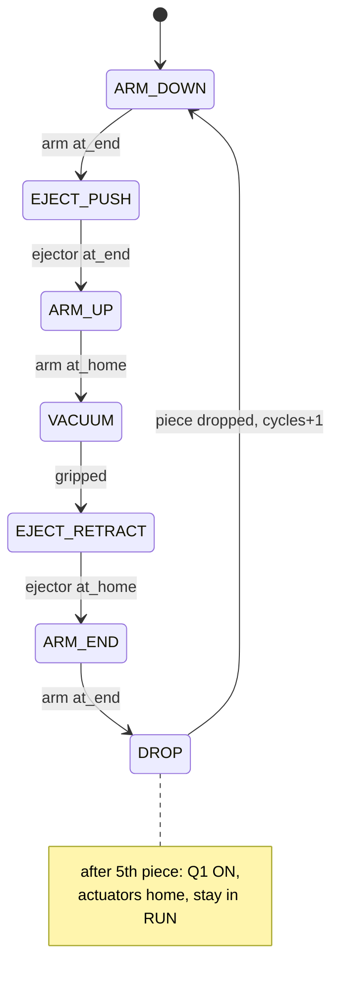

# Main_Distributing — ST (Milestones 1.9 / 1.10)

The 4th block. Owns the 7-step cycle sequencer, the vacuum/ejector-pulse valves,
the unused I/O, Q1/Q2, the batch counter, and fault aggregation into `FB_Panel`.
Canonical source: `../../usb/st/Main_Distributing.st`. Block diagram:
`../block_diagrams.md`. Sequence FSM below.

## The 7-step cycle (milestone 1.9's numbered list)



Each step commands one actuator (via `go_arm`/`go_ej`) or toggles a Main-owned
valve (vacuum / ejector pulse), and advances when that actuator reports the
expected position. Pause behaviour falls straight out of the FBs: in an ARM step
the arm (T1) **freezes immediately**; in an EJECT step the ejector (T2) **finishes
its stroke** — exactly what protocol 1.9 Phase 2 tests.

## Structured Text (type-in-ready)

```iecst
PROGRAM Main_Distributing
VAR
    Panel : FB_Panel; Arm : FB_Actuator_T1; Ejector : FB_Actuator_T2;
    si : INT := 0; cycles : INT := 0; grip, drop : INT := 0;
    go_arm, go_ej, vacuum, eject_pulse, fault, reset_done : BOOL;
    ROBUST : BOOL := TRUE;   // 1.10 = TRUE, 1.9 = FALSE
    MAG : INT := 5;
END_VAR

reset_done := Arm.at_home AND Ejector.at_home;
Panel(s1_start := Panel_S1, s2_stop := Panel_S2, s4_reset := Panel_S4,
      error_in := fault, reset_done := reset_done);

IF Panel.reset_mode OR Panel.error_mode THEN
    si := 0; grip := 0; drop := 0; vacuum := FALSE; eject_pulse := FALSE;
    IF Panel.reset_mode THEN cycles := 0; END_IF;
END_IF;

go_arm := FALSE; go_ej := FALSE; eject_pulse := FALSE;
IF Panel.run_mode AND cycles < MAG THEN
    CASE si OF
    0:  go_arm := TRUE;  IF Arm.at_end THEN si := 1; END_IF;
    1:  go_ej  := TRUE;  IF Ejector.at_end THEN si := 2; END_IF;
    2:  go_arm := TRUE;  IF Arm.at_home THEN si := 3; END_IF;
    3:  vacuum := TRUE;  grip := grip+1; IF grip >= 1 THEN grip := 0; si := 4; END_IF;
    4:  go_ej := FALSE;  IF Ejector.at_home THEN si := 5; END_IF;
    5:  go_arm := TRUE;  IF Arm.at_end THEN si := 6; END_IF;
    6:  eject_pulse := TRUE; vacuum := FALSE; drop := drop+1;
        IF drop >= 1 THEN drop := 0; cycles := cycles+1; si := 0; END_IF;
    END_CASE;
END_IF;

Arm(run_mode := Panel.run_mode, pause_mode := Panel.pause_mode,
    reset_mode := Panel.reset_mode, error_mode := Panel.error_mode,
    sensor_home := Station_3S1, sensor_end := Station_3S2, go := go_arm,
    t_stall := T#2s, robust := ROBUST);
Ejector(run_mode := Panel.run_mode, pause_mode := Panel.pause_mode,
    reset_mode := Panel.reset_mode, error_mode := Panel.error_mode,
    sensor_home := Station_1B1, sensor_end := Station_1B2, go := go_ej,
    t_stall := T#2s, robust := ROBUST);

fault := ROBUST AND ( Arm.error OR Ejector.error
    OR (Panel.run_mode AND vacuum AND NOT Station_2B1)
    OR (Panel.run_mode AND Arm.at_home AND Station_B4 AND si <> 0) );

Station_3Y2 := Arm.valve_to_end;   Station_3Y1 := Arm.valve_to_home;
Station_1Y1 := Ejector.valve_extend;
Station_2Y1 := vacuum      AND NOT Panel.error_mode;
Station_2Y2 := eject_pulse AND NOT Panel.error_mode;
Station_H1  := Panel.start_light;  Station_H2 := Panel.reset_light;
Panel_H3    := (cycles >= MAG);    Panel_H4  := Panel.error_mode;
END_PROGRAM
```

## Proper vs robust

- **1.9 (proper):** `ROBUST := FALSE`. No fault sources; the 5-piece cycle runs,
  Q1 lights after the 5th, station stays in Run.
- **1.10 (robust):** `ROBUST := TRUE`. `fault` fires on a stalled arm/ejector, a
  piece pulled off the vacuum (`Station_2B1` lost while vacuum on), or the arm
  reaching an empty magazine (`Station_B4`) — each drives Q2, valves off, recover
  by Reset then Start. Block diagram is unchanged (still 4 blocks).

`Station_B4` (magazine empty) and `IP_FI` are the "unused" sensors the milestone
wants housed in the main block; both are referenced here. For the integrated line,
gate step 6's delivery on `IP_FI` (succeeding station free).
