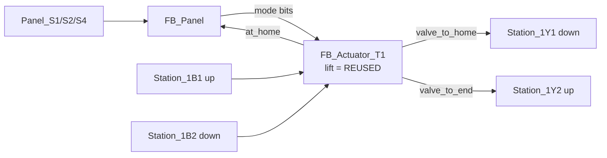
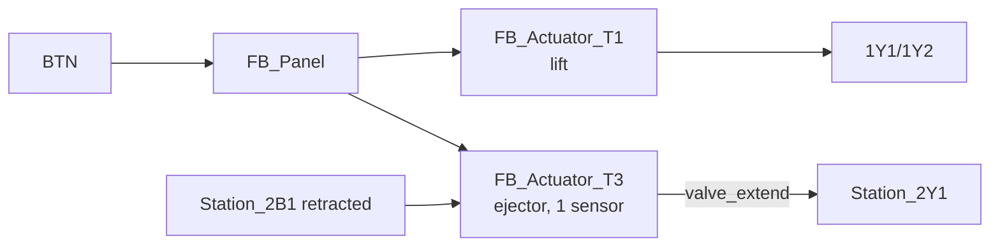
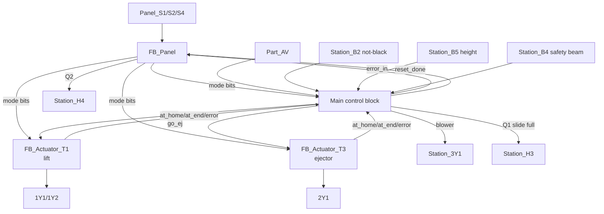
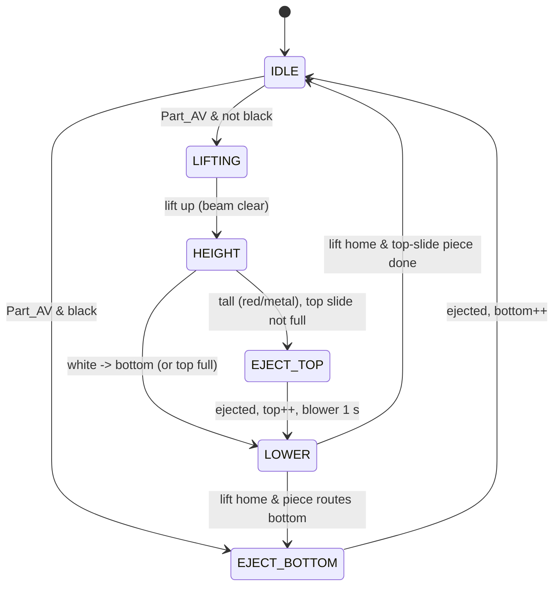

# Testing Station — Block Diagrams (2.2 → 2.4 → 2.6)

Grows the same way as Station 1. The lift block is `FB_Actuator_T1` **reused** from
the Distributing station (L.1 credit); the ejector is the new `FB_Actuator_T3`.

## 2-block — Milestone 2.2 (lift only)

## 3-block — Milestone 2.4 (add ejecting cylinder T3)

## 4-block — Milestone 2.6 / 2.7 (full station)

**The four blocks:** `FB_Panel`, `FB_Actuator_T1` (lift, reused),
`FB_Actuator_T3` (ejector), **Main**. Main owns the colour/height sort decision,
the blower, the top/bottom slide counters, the safety-beam interlock and Q1/Q2 —
i.e. every sensor/valve not belonging to an actuator FB (`Part_AV`, `B2`, `B5`,
`B4`, `3Y1`), which is the "unused sensors/valves in a block" 2.6 requires.

For 2.7 (robust) the diagram is unchanged; the actuator FBs get `robust := TRUE`
and Main adds the slide-full and beam faults to `error_in`.

## Main sequence FSM (per-piece, milestone 2.6)

- **White / black → bottom slide; red/metal → top slide** (blower on ~1 s during
  the top-slide transfer).
- **Black never lifts** (goes straight to `EJECT_BOTTOM`).
- **2.7 robust:** if a white piece meets a **full** bottom slide it stops at entry
  and Q2 fires (reset required); a non-white piece with the bottom full still goes
  to the top slide (station stays in Run); Q1 lights when the bottom slide reaches
  5. Beam blocked > 3 s → Q2. Lift held > `t_stall` → Q2.
