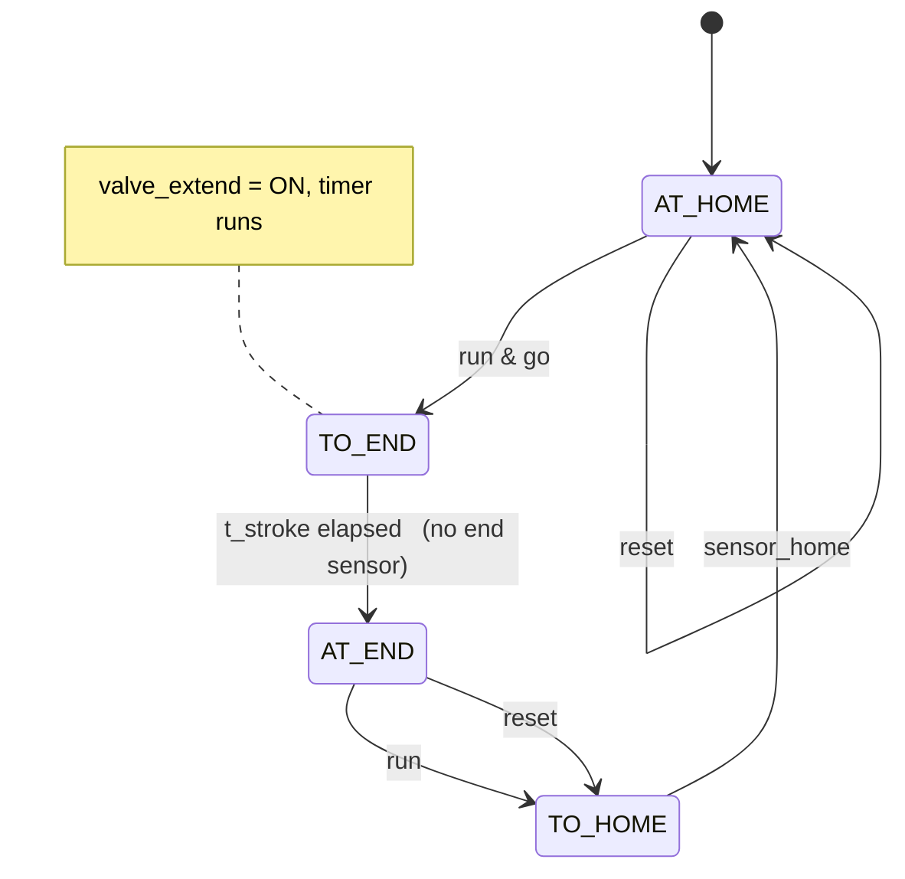
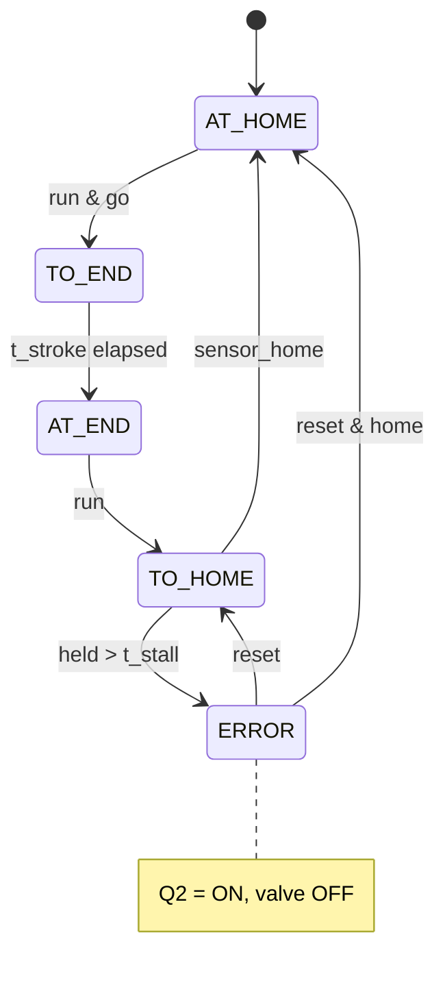

# FB_Actuator_T3 — Finite-State Diagram (Milestones 2.4 / 2.5)

Stroke-completing single-acting cylinder with **only one limit sensor** (the
retracted switch). The Testing ejecting cylinder. Behaves like T2 except the **extended end has no
switch**, so it is inferred from a stroke timer `t_stroke`.

## Proper (Milestone 2.4)

## Robust (Milestone 2.5) — stall on the retract leg

## The single-sensor limitation (state it in your logbook)

Because there is no **extended** limit switch, the FB cannot verify the extend
stroke — it trusts `t_stroke`. Stall detection is therefore only possible on the
**retract** leg (failing to reach `sensor_home` within `t_stall`). A cylinder held
while extended is caught on the following retract attempt: the piece isn't fully
ejected, the cylinder cannot return home, and the retract stall fires Q2. This is
the honest, hardware-accurate behaviour; the double-sensor lift (T1) is the primary
"manually held" actuator the robust milestone exercises.

`t_stroke` and `t_stall` are FB **inputs** — set `t_stroke` just longer than the
real extend travel; tune both at the bench.
