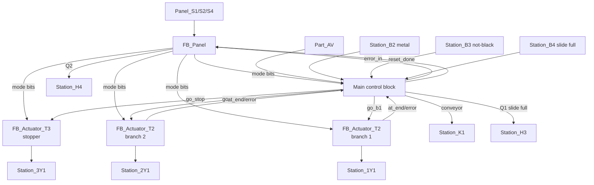
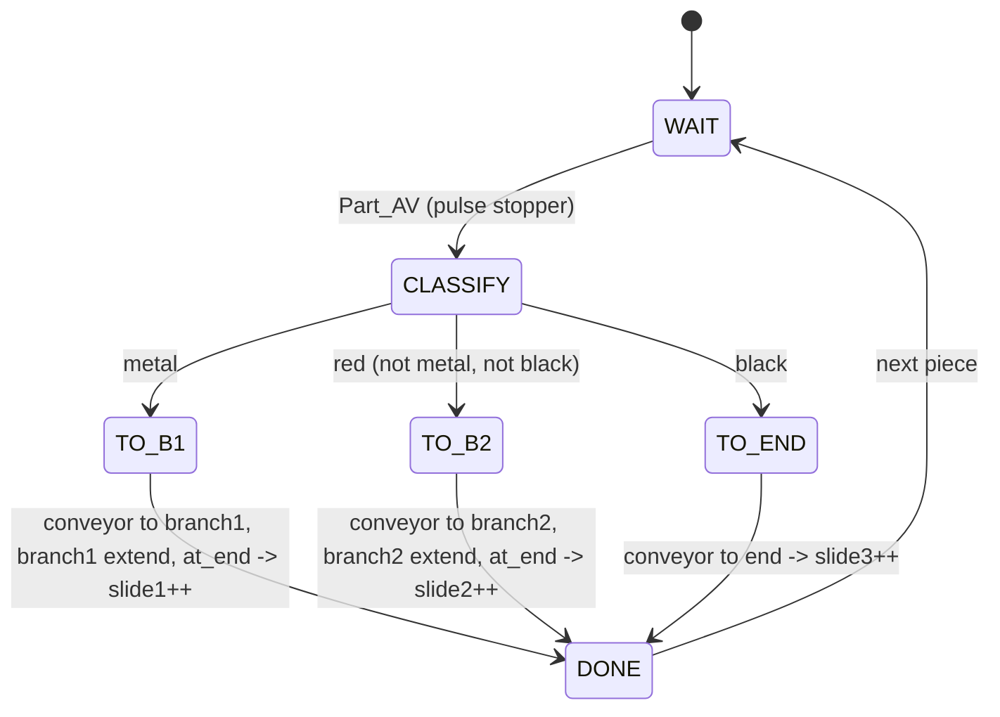

# Sorting Station — Block Diagram (5 blocks, Milestone 3.2)

Milestone 3.2 asks for a **5-block** diagram. The two branches and the stopper are
reused actuator FBs; Main owns the conveyor, recognition and counters.

**The five blocks:** `FB_Panel`, `FB_Actuator_T2` (branch 1), `FB_Actuator_T2`
(branch 2), `FB_Actuator_T3` (stopper), **Main**. Main owns the conveyor
(`Station_K1`), the recognition sensors (`B2`/`B3`), the slide-full interlock
(`B4`), the three slide counters, and Q1/Q2 — the "unused sensors/valves in a
block" 3.2 requires.

## Sort sequence FSM (per piece)

- **Metal → branch 1 / slide 1; red → branch 2 / slide 2; black → straight /
  slide 3.**
- **Any slide full** (`Station_B4` or a counter at 5) → **Q1 on and the station
  changes to Error** (test 3.1.2) — Q1 and Q2 both light.
- **3.2 robust:** 6 back-to-back pieces (2 black, 2 red, 2 metal) sort correctly;
  a **branch held** → Q2 (T2 stall); a **piece removed** before reaching a slide →
  Q2. Diagram unchanged; branches get `robust := TRUE`.
- **Pause:** a branch mid-stroke **completes to its limit** then halts (T2); the
  conveyor stops on Stop and resumes on Start, re-sorting the piece correctly.
