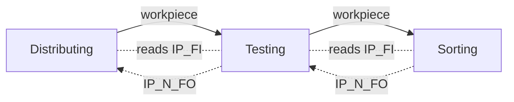
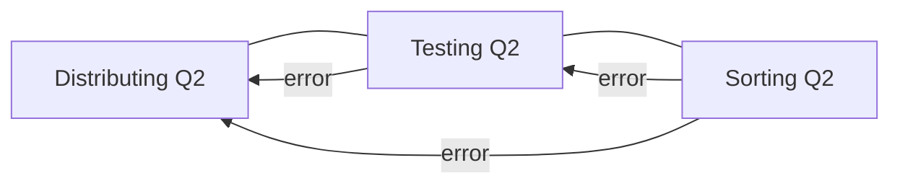

# Integrated Production Line: Design (Milestones L.1, L.2, L.3)

The three stations run as one line, reusing the same function blocks with only
their station I/O changed. This is the shared-FB design from milestone 1.6's note.

> Doc typo note: the prerequisite printed as "3.7" for S3.1 and L.1 is **3.4**
> (there is no 3.7). Handled silently everywhere.

## L.1: Function-block reuse across stations (3 marks)

The whole line is built from **four** function blocks plus a per-station Main. L.1
credits each FB being the same block on multiple stations:

| Function block | Distributing | Testing | Sorting | Role |
|---|:---:|:---:|:---:|---|
| **FB_Panel** | ✅ | ✅ | ✅ | control panel on all 3 |
| **FB_Actuator_T1** | ✅ arm | ✅ lift | — | holdable double-solenoid |
| **FB_Actuator_T2** | ✅ ejector | — | ✅ branch 1 + branch 2 | stroke-completing, 2 sensors |
| **FB_Actuator_T3** | — | ✅ ejector | ✅ stopper | stroke-completing, 1 sensor |

The blocks are **generic**: station-specific I/O is wired only at the **call site**
(the Main program passes the right sensors/valves and the `robust` / timer inputs).
The FB bodies never change between stations; that is what L.1 asks you to
demonstrate. `FB_Panel` in particular is byte-for-byte identical on all three
(`../usb/st/FB_Panel.st`).

Design decision that makes this hold: milestone 1.9 forbids `Station_2Y1`/`2Y2`
(vacuum, ejector pulse) inside `FB_Actuator_T1`. Because those live in Main, the
arm block carries no distributing-only baggage and drops straight onto the Testing
lift.

## Inter-station handshake (IP_FI / IP_N_FO)

Adjacent suitcases are wired station-to-station:

- **`IP_N_FO`** (output, "station occupied"): a station asserts it while it holds
  a workpiece / is busy.
- **`IP_FI`** (input, "succeeding station free"): the upstream station reads the
  downstream station's `IP_N_FO` (inverted sense: free when not occupied) and only
  hands a workpiece over when the next station is ready.

Wiring: Distributing's `IP_FI` ← Testing's `IP_N_FO`; Testing's `IP_FI` ←
Sorting's `IP_N_FO`. In each Main, gate the **delivery step** on `IP_FI` (Main_*
already asserts `IP_N_FO := run_mode`; for full handshake set it while a piece is
in process and clear it once handed over).

## L.2: Line functioning properly (5 marks)

- **Master control from Sorting.** Only the Sorting station's Start/Stop/Reset
  buttons switch the whole line to run/reset/pause. Distribute the Sorting panel's
  mode to all three stations. Two equivalent implementations:
  1. **Signal-wired:** carry Sorting's `run/reset/pause` mode bits to the other two
     stations over the suitcase I/O and feed them into each `FB_Panel`'s buttons
     (the downstream stations ignore their own S1/S2/S4).
  2. **Distributed panel:** each station keeps its `FB_Panel`, but the Testing and
     Distributing panels take their `S1/S2/S4` from the Sorting panel's outputs
     rather than local buttons.

  Option 1 is the arrangement described here (the Sorting buttons drive all three
  panels).
- **Reset with actuators mid-travel:** set the swivel arm and the lift in-between,
  press Reset on Sorting → all stations home (each `FB_Actuator_T1` drives home;
  `reset_done` returns each panel to Pause).
- **Process 2 red, 2 metal, 2 black, 2 white**, pausing/resuming three times (arm
  in-between, lift in-between, piece on the conveyor). Each Main's pause semantics
  (T1 freezes, T2/T3 complete stroke, conveyor stops) give clean resume.

## L.3: Line functioning robustly (6 marks)

Everything in L.2, plus **error propagation upstream only** and master reset:

- **Q2 propagates upstream**, because a fault at a station means every station
  feeding it must also stop:

  | Faulting station | Stations forced to Error (Q2 on) |
  |---|---|
  | **Sorting** | Sorting + Testing + Distributing (**all 3**) |
  | **Testing** | Testing + Distributing (**2**) |
  | **Distributing** | Distributing only (**1**) |

  Implement by ORing the downstream station's `error_mode` into each upstream
  station's `FB_Panel.error_in` (Sorting → Testing and Distributing; Testing →
  Distributing).

- **Cleared only from the Sorting panel.** The upstream stations' faults latch
  until the Sorting Reset sequence clears the master, which un-propagates the error
  and lets all stations home.

- **L.3 test mapping (verified):**
  - Piece missing at Sorting → **all three Q2** on.
  - Safety beam blocked > 3 s → **Testing + Distributing Q2** (two lights;
    Sorting is downstream of the fault so stays clear).
  - Swivel arm held → **Distributing Q2 only** (it is the most upstream; nothing
    feeds it).

## Build order in the lab

Because every FB is already verified and reused, L.1 is mostly a **wiring +
demonstration** milestone: confirm the same FB instances on each station, wire the
`IP_FI`/`IP_N_FO` handshake and the Sorting-master mode distribution, add the
upstream `error_in` OR-links, then run L.2 and L.3. No new blocks are written.
